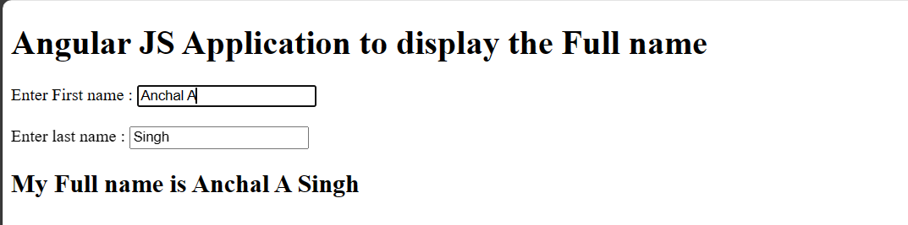

# AngularJS Full Name Display Program

## Aim
Develop an AngularJS program that allows users to input their first name and last name and displays their full name. Default values for the first name and last name may be included in the program.

## Introduction
AngularJS is an open-source JavaScript framework developed by Google for building dynamic web applications. It provides a modular and clean approach to web development, allowing developers to easily manage and organize their code. AngularJS applications are built using directives, with some key directives discussed below.

## Directives Used

### 1. `ng-app`
This directive initiates an AngularJS application. It marks the starting point of the AngularJS framework in the HTML document.

### 2. `ng-init`
The `ng-init` directive is used to initialize application data. It allows the specification of default values or initializations required for the application.

### 3. `ng-model`
The `ng-model` directive defines the model, representing variables used in AngularJS. It establishes a connection between the input elements and the application data.

### 4. `ng-module`
AngularJS supports a modular approach for organizing code. Modules help separate logic, such as services, controllers, and applications, to maintain clean code. In this example, we create two modules:

- **Application Module**: Initializes the application with controller(s).
- **Controller Module**: Defines the controller for handling data flow.

### 5. `ng-controller`
AngularJS applications heavily rely on controllers to manage data flow. The `ng-controller` directive is used to define controllers. A controller is a JavaScript object containing attributes, properties, and functions. It accepts `$scope` as a parameter, referring to the application/module it handles.

## Output

